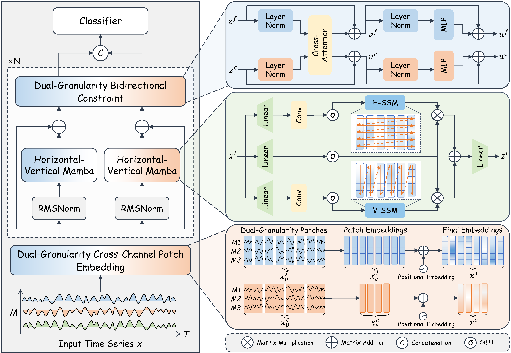

# DBLN


## Introduction
DBLN (Deep Bidirectional Learning Network) is a deep learning model for time series modeling, suitable for multivariate time series classification and forecasting tasks. This project implements DBLN and related experiments, supporting various public datasets.

## Features
- Supports multivariate time series modeling
- End-to-end training, easy to extend
- Multiple data augmentation and normalization methods
- Compatible with mainstream dataset formats

## Installation & Dependencies
```bash
pip install -r requirements.txt
```
Python 3.8+ is recommended. It is suggested to use a virtual environment or Anaconda.

## Quick Start
Example for training:
```bash
python run.py --dataset BasicMotions
```
Parameters can be adjusted in run.py or related config files.

## Dataset
The `data/UEA/` directory contains only a subset of datasets for demonstration. The complete UEA multivariate time series archive can be downloaded from the official website:

[https://www.timeseriesclassification.com/](https://www.timeseriesclassification.com/)

## Training & Testing
You can train and test the model using the run.py script, with customizable command-line arguments.

## Results

The following table reports the classification results on 30 UEA datasets.

<details>
<summary>Show results table</summary>

| Dataset | SoftShapeNet | TEFN | TSLANet | Medformer | ModernTCN | UniTS | TimeMixer | iTransformer | LightTS | Crossformer | PatchTST | DLinear | FEDformer | Informer | Reformer | DBLN |
| --- | --- | --- | --- | --- | --- | --- | --- | --- | --- | --- | --- | --- | --- | --- | --- | --- |
| ArticularyWordRecognition | 0.9826 | 0.9217 | 0.9739 | 0.9913 | 0.9826 | 0.9304 | 0.9652 | 0.9826 | 0.9478 | 0.9652 | 0.9739 | 0.9478 | 0.6696 | 0.9826 | 0.9826 | 0.9913 |
| AtrialFibrillation | 0.3333 | 0.3333 | 0.5 | 0.3333 | 0.1667 | 0.3333 | 0.3333 | 0.3333 | 0.6667 | 0.3333 | 0.3333 | 0.3333 | 0.5 | 0.5 | 0.3333 | 0.6667 |
| BasicMotions | 1 | 0.6875 | 1 | 1 | 0.8125 | 0.75 | 0.8125 | 0.875 | 1 | 0.875 | 0.625 | 0.875 | 0.9375 | 1 | 1 | 1 |
| CharacterTrajectories | 0.993 | 0.9703 | 0.9948 | 0.993 | 0.9825 | 0.986 | 0.9895 | 0.979 | 0.9825 | 0.9825 | 0.9738 | 0.9738 | 0.9545 | 0.986 | 0.9843 | 0.9965 |
| Cricket | 1 | 0.9167 | 1 | 1 | 0.8889 | 0.9167 | 0.8889 | 0.8333 | 0.9167 | 0.9722 | 0.8333 | 0.9444 | 0.4722 | 0.9167 | 0.8889 | 1 |
| DuckDuckGeese | 0.75 | 0.3 | 0.7 | 0.45 | 0.6 | 0.15 | 0.6 | 0.4 | 0.55 | 0.45 | 0.2 | 0.65 | 0.1 | 0.5 | 0.6 | 0.7 |
| EigenWorms | 0.7885 | 0.5 | 0.8462 | 0.6923 | 0.5962 | 0.5577 | 0.5962 | 0.5577 | 0.3654 | 0.4615 | 0.3077 | 0.4231 | 0.4038 | 0.4423 | 0.7885 | 0.9038 |
| Epilepsy | 0.9273 | 0.6909 | 0.9273 | 0.9273 | 0.9455 | 0.9818 | 0.8 | 0.7636 | 0.8545 | 0.9091 | 0.9273 | 0.5455 | 0.9636 | 0.9455 | 0.9455 | 0.9818 |
| ERing | 0.9667 | 0.9333 | 0.9167 | 0.9667 | 0.9667 | 0.9667 | 0.9667 | 0.9667 | 0.95 | 0.95 | 0.9667 | 0.95 | 0.95 | 0.9667 | 0.95 | 0.9833 |
| EthanolConcentration | 0.2476 | 0.3429 | 0.2667 | 0.3619 | 0.3238 | 0.2476 | 0.3238 | 0.3619 | 0.2571 | 0.3524 | 0.5429 | 0.2381 | 0.2667 | 0.3238 | 0.3048 | 0.3429 |
| FaceDetection | 0.6081 | 0.7424 | 0.6022 | 0.7079 | 0.7175 | 0.7185 | 0.7047 | 0.7254 | 0.7398 | 0.735 | 0.7127 | 0.7573 | 0.7297 | 0.7515 | 0.7546 | 0.727 |
| FingerMovements | 0.5663 | 0.494 | 0.5422 | 0.5422 | 0.4096 | 0.5542 | 0.5542 | 0.5422 | 0.6145 | 0.4096 | 0.6145 | 0.4337 | 0.4578 | 0.4819 | 0.5181 | 0.6024 |
| HandMovementDirection | 0.2128 | 0.2766 | 0.1702 | 0.1277 | 0.2979 | 0.383 | 0.4043 | 0.3404 | 0.3404 | 0.4681 | 0.3617 | 0.4043 | 0.1489 | 0.383 | 0.2979 | 0.2553 |
| Handwriting | 0.81 | 0.295 | 0.71 | 0.58 | 0.49 | 0.655 | 0.405 | 0.515 | 0.345 | 0.515 | 0.56 | 0.365 | 0.39 | 0.565 | 0.555 | 0.795 |
| Heartbeat | 0.7439 | 0.7561 | 0.7683 | 0.7561 | 0.7927 | 0.7683 | 0.7805 | 0.7805 | 0.7561 | 0.7683 | 0.6341 | 0.7561 | 0.7073 | 0.7683 | 0.6951 | 0.7927 |
| InsectWingbeat | 0.6146 | 0.6632 | 0.6027 | 0.601 | 0.6808 | 0.7481 | 0.6528 | 0.7285 | 0.7237 | 0.7283 | 0.6925 | 0.1977 | 0.6636 | 0.6726 | 0.6748 | 0.6205 |
| JapaneseVowels | 0.9688 | 0.8828 | 0.9609 | 0.9766 | 0.9844 | 0.9531 | 0.9844 | 0.9609 | 0.9609 | 0.9688 | 0.9688 | 0.9688 | 0.9766 | 0.9844 | 0.9844 | 0.9844 |
| Libras | 0.8472 | 0.3611 | 0.8889 | 0.9028 | 0.875 | 0.7639 | 0.8333 | 0.9167 | 0.8194 | 0.9028 | 0.8056 | 0.7361 | 0.9028 | 0.8611 | 0.875 | 0.9167 |
| LSST | 0.5411 | 0.3533 | 0.5716 | 0.4904 | 0.4081 | 0.6305 | 0.5086 | 0.6193 | 0.5208 | 0.5777 | 0.603 | 0.3188 | 0.5543 | 0.5645 | 0.599 | 0.6223 |
| MotorImagery | 0.5658 | 0.5132 | 0.4605 | 0.5 | 0.3947 | 0.4737 | 0.5395 | 0.5 | 0.4211 | 0.5 | 0.5526 | 0.4605 | 0.5263 | 0.5132 | 0.5263 | 0.6053 |
| NATOPS | 0.9861 | 0.75 | 0.9583 | 0.9306 | 0.9306 | 0.7083 | 0.9444 | 0.8472 | 0.9444 | 0.875 | 0.7083 | 0.8889 | 0.9167 | 0.9583 | 0.9861 | 0.9861 |
| PEMS-SF | 0.7955 | 0.7614 | 0.7727 | 0.8182 | 0.7841 | 0.7841 | 0.7045 | 0.7841 | 0.7159 | 0.7841 | 0.7273 | 0.7614 | 0.7614 | 0.7386 | 0.6932 | 0.8295 |
| PenDigits | 0.9945 | 0.8381 | 0.9941 | 0.9936 | 0.9945 | 0.995 | 0.9936 | 0.9945 | 0.9859 | 0.9927 | 0.9955 | 0.9145 | 0.9964 | 0.9955 | 0.995 | 0.9955 |
| PhonemeSpectra | 0.1739 | 0.0622 | 0.2451 | 0.2061 | 0.1297 | 0.1972 | 0.1289 | 0.1064 | 0.1034 | 0.1387 | 0.1102 | 0.0525 | 0.1169 | 0.099 | 0.099 | 0.2166 |
| RacketSports | 0.7049 | 0.4262 | 0.7377 | 0.7705 | 0.7049 | 0.7213 | 0.7869 | 0.7541 | 0.7213 | 0.7869 | 0.7213 | 0.7377 | 0.8033 | 0.9344 | 0.9016 | 0.8197 |
| SelfRegulationSCP1 | 0.8393 | 0.8214 | 0.8393 | 0.8661 | 0.8393 | 0.7857 | 0.8482 | 0.8393 | 0.8661 | 0.8393 | 0.8482 | 0.8304 | 0.5089 | 0.8482 | 0.8482 | 0.8125 |
| SelfRegulationSCP2 | 0.5132 | 0.5658 | 0.5263 | 0.5526 | 0.5395 | 0.4605 | 0.5 | 0.5395 | 0.5395 | 0.5263 | 0.5263 | 0.5132 | 0.6184 | 0.5526 | 0.5395 | 0.5526 |
| SpokenArabicDigits | 0.9915 | 0.9784 | 0.9966 | 0.9938 | 0.9903 | 0.9909 | 0.9892 | 0.9915 | 0.9778 | 0.9932 | 0.9898 | 0.983 | 0.9881 | 0.9915 | 0.9926 | 0.996 |
| StandWalkJump | 0.1667 | 0.6667 | 0.3333 | 0.3333 | 0.5 | 0.6667 | 0.5 | 0.5 | 0.5 | 0.5 | 0.5 | 0.3333 | 0.3333 | 0.5 | 0.1667 | 0.8333 |
| UWaveGestureLibrary | 0.9886 | 0.8636 | 0.9545 | 0.9091 | 0.9205 | 0.9432 | 0.9091 | 0.9659 | 0.8864 | 0.9205 | 0.8864 | 0.8977 | 0.4886 | 0.9318 | 0.9318 | 1 |
| Avg.Acc | 0.720721 | 0.622272 | 0.725367 | 0.709141 | 0.68831 | 0.690714 | 0.698278 | 0.700155 | 0.699107 | 0.706048 | 0.673419 | 0.639724 | 0.626911 | 0.721961 | 0.713721 | 0.784327 |
| Win | 5 | 0 | 4 | 4 | 2 | 3 | 1 | 1 | 4 | 1 | 2 | 1 | 2 | 3 | 3 | 16 |
| Avg.Rank | 6.766667 | 11.6 | 7.166667 | 6.433333 | 8.133333 | 8.133333 | 8.066667 | 7.1 | 9.2 | 7.433333 | 8.8 | 11.166667 | 9.9 | 5.7 | 6.766667 | 2.933333 |
| P_value | 0.000215614 | 1.76907e-05 | 6.0125e-05 | 0.000107419 | 0.000143054 | 0.00014772 | 0.000161136 | 0.000562874 | 0.00049372 | 0.000528725 | 0.00083542 | 2.59671e-05 | 1.97295e-05 | 0.00541786 | 0.00194028 | - |

</details>
